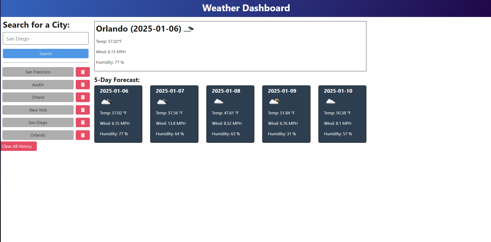

# Alex's Weather Dashboard Application

## **Description**
This Weather Dashboard Application allows users to search for current and forecasted weather data for any city worldwide. It fetches data using the **OpenWeather API** and dynamically displays the results, including a **5-day forecast**. Users can also view their search history, which is stored locally and can be deleted as needed.

## **Table of Contents**
- [Installation](#installation)
- [Usage](#usage)
- [Features](#features)
- [Technologies](#technologies)
- [License](#license)
- [Deployment](#deployment)
- [Grading Criteria](#grading-criteria)
- [Screenshots](#screenshots)
- [Future Enhancements](#future-enhancements)

---

## **Installation**
1. **Clone the repository:**
    ```Bash
    git clone https://github.com/YourGitHubUsername/Alex-s-API-weather-dashboard.git
2. **Navigate to the project directory:****
    ```Bash
    cd Alex-s-API-weather-dashboard
3. **Install dependencies:**
    ```Bash
    npm install
4. **Run Build**
    ```Bash
    npm run build --prefix client
5. **Start the server:**
    ```Bash
    npm run dev --prefix server
6. **Open `http://localhost:3001` in your browser.**

---

## **Usage**
- Enter a **city name** in the search bar and click the **Search** button.
- View the **current weather** and a **5-day forecast**.
- Use the **search history** buttons to revisit previous searches.
- Remove any city from the search history by clicking the **delete button**.
- Clear the entire search history with the **Clear All History** button.
---

## **Features**
- **Real-Time Weather Data:** Fetches weather data for any valid city.
- **Search History Management:** Stores and displays previously searched cities.
- **Error Handling:** Provides alerts for invalid city names and API errors.
- **Responsive Design:** Works across various screen sizes.
- **Delete Search History:** Users can delete previously searched cities.
- **Forecast Display:** Shows 5-day weather forecasts with temperature, wind speed, and humidity.

---

## **Technologies**
- **Frontend:** HTML5, CSS3, TypeScript, Bootstrap.
- **Backend:** Node.js, Express.js.
- **API Integration:** OpenWeather API.
- **Version Control:** Git and GitHub.

---

## **License**
This project is licensed under the **MIT License**.

---

## **Deployment**
This application is deployed and can be access at the following link:

[Weather Dashboard on Render](https://alex-s-api-weather-dashboard.onrender.com/)

---

## **Grading Criteria**
### **Technical Acceptance Criteria (40%)**
- Uses the OpenWeather API to retrieve and display weather data.
- Proper error handling for invalid or nonexistent city inputs.
- Persistent search history stored locally or in a JSON database.

### **Deployment and Repository (32%)**
- Deployed application with a functional link.
- GitHub repository includes a detailed README and links to deployed application.

### **Application Quality (15%)**
- Application displays data dynamically using DOM manipulation.
- Organized and commented code for readability.
- Meets responsive design principles for desktop and mobile devices.

### **Bonus Features (13%)**
- Displays the **country** along with the city name.
- Allows users to **clear all search history** with a single button.
- Provides **loading indicators** during API calls.
- Displays **error alerts** for invalid inputs without breaking the application.

---

## **Screenshots**

### Example of Current Weather and 5-Day Forecast:


---

## **Future Enhancements**
1. **Country Information:** Display the country name next to the city.
2. **Advanced Search Options:** Filter results based on temperature ranges or weather conditions.
3. **Interactive Map Integration:** Display weather data on a map.
4. **User Authentication:** Save personalized search history for logged-in users.
5. **Export Feature:** Allow users to export weather data as a CSV or PDF file.

---

## **Contact**
For questions, feel free to reach out via GitHub or email:
- **GitHub:** [Amarrero0215](https://github.com/Amarrero0215)
- **Email:** alexmarrero0215@gmail.com
